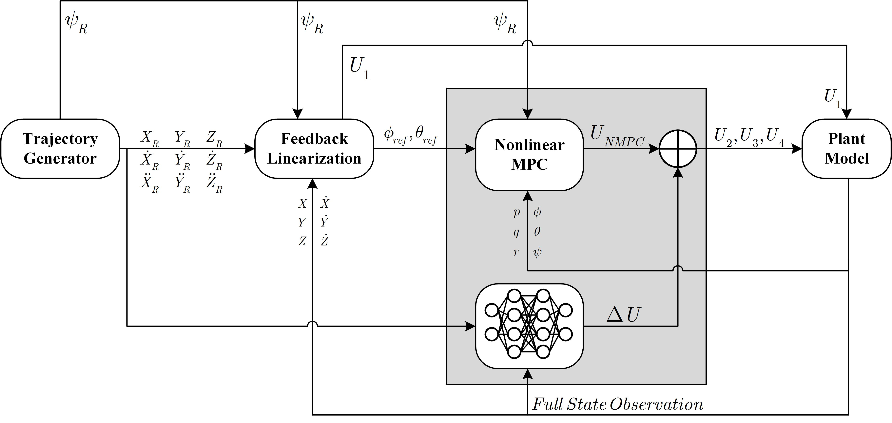

# 01. System Architecture

## 1.1 Overview

This project develops a hierarchical control framework for trajectory tracking of a quadrotor UAV.

The proposed framework integrates:

- Parametric Trajectory Generation (via `trajectory_generator.m`) for generating complex 3D reference paths.
- Feedback Linearization (FL) for outer-loop position control.
- Safe RL-NMPC (Nonlinear Model Predictive Control combined with a TD3 Reinforcement Learning agent) for inner-loop attitude control.
- MATLAB/Simulink environment for rigorous simulation and validation.

Unlike the previous iteration of this project which utilized separated bandwidths for the position and attitude dynamics, the current architecture employs a flattened, fully synchronous control loop.

  
   <em>Figure: Block diagram of the proposed Safe RL-NMPC quadrotor control system.</em>

## 1.2 Control Architecture

The system is organized into a cohesive, synchronous control structure.

### Outer Loop — Position Control

The outer loop regulates the quadrotor position in the 3D space:

$$
\mathbf{p} =
\begin{bmatrix}
x & y & z
\end{bmatrix}^{T}
$$

It is responsible for tracking the reference trajectory generated by the trajectory planner.

Feedback Linearization is used to compensate for the nonlinear translational dynamics. This loop generates:

- Total thrust command $U_1$.
- Reference attitude angles:

$$
\begin{bmatrix}
\phi_d & \theta_d & \psi_d
\end{bmatrix}
$$

These commands are directly passed to the inner-loop attitude controller.

### Inner Loop — Safe RL-NMPC Attitude Control

Instead of using a multi-rate Linear Parameter-Varying (LPV) approach, the inner loop now regulates the attitude of the quadrotor using a fully nonlinear 6-DOF MPC augmented by Deep Reinforcement Learning.

- The **NMPC** handles the mathematical optimization and strictly enforces physical constraints on the control inputs.
- The **TD3 RL Agent** acts as a parallel compensator, evaluating the state errors and generating a residual control signal to mitigate nonlinear aerodynamic effects.

To avoid the temporal delay issues observed in multi-rate systems, this inner loop operates synchronously with the outer position loop at a unified sampling time of $T_s = 0.1s$.

---

## 1.3 Development Flow

The complete control process follows this pipeline:

$$
\mathrm{Trajectory\ Generator}
\rightarrow
\mathrm{Position\ Controller\ (FL)}
\rightarrow
\mathrm{Safe\ (RL\-NMPC)}
\rightarrow
\mathrm{Plant\ Model\ (Quadrotor)}
$$

The complete framework is validated through MATLAB simulation, with a strong emphasis on tracking accuracy, stability, transient response, and strict constraint satisfaction.

---

## 1.4 Project Objectives

The primary objectives of this framework are:

1. Formulate a comprehensive mathematical model of the quadrotor.
2. Design a synchronous hierarchical position and attitude control architecture.
3. Develop an NMPC-based attitude controller augmented by a TD3 RL agent to handle physical constraints and nonlinearities.
4. Develop a Feedback Linearization-based position controller.
5. Generate diverse and complex continuous reference trajectories (e.g., Spiral, Figure-Eight, 3D Lissajous) to evaluate system robustness.
6. Validate the complete zero-shot generalization capabilities of the system in MATLAB.
