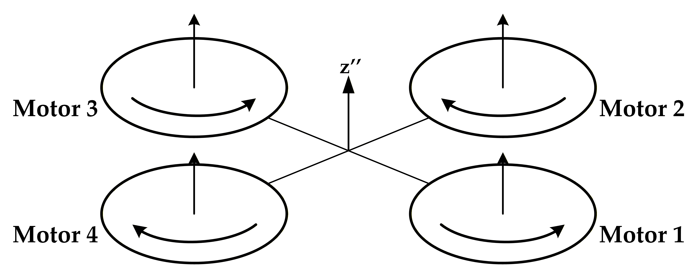
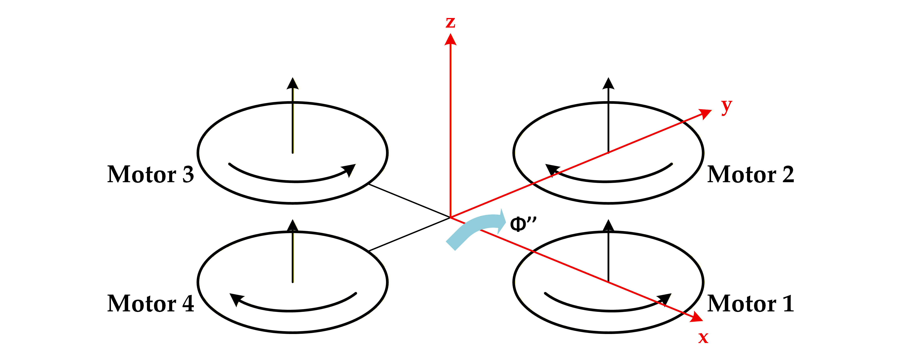
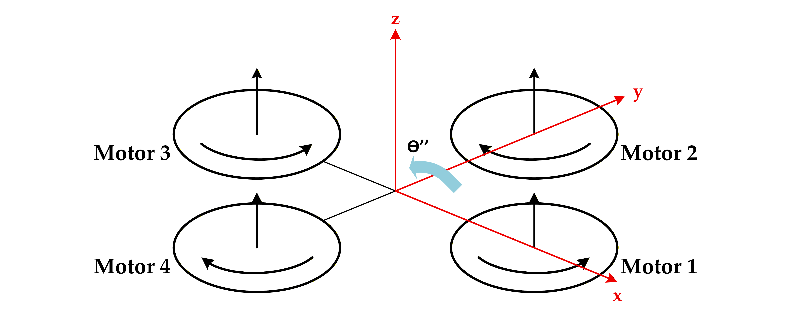
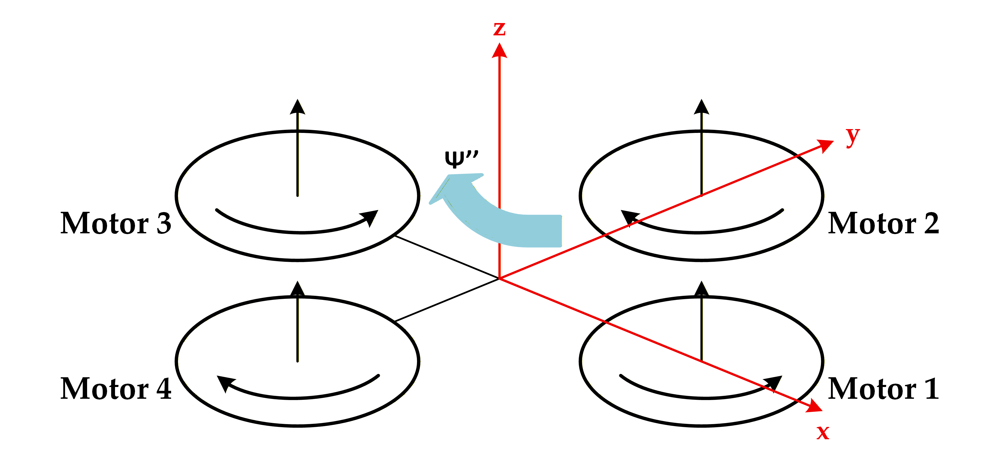

# 02. Nonlinear 6-DOF Quadrotor Dynamics

The quadrotor is modeled as a nonlinear 6-degree-of-freedom (6-DOF) rigid-body system based on the Newton-Euler formulation. This mathematical model captures translational motion, rotational motion, gyroscopic effects of the rotating propellers, and the inherent coupling between translation and rotation.

The resulting nonlinear model provides the physics foundation for the subsequent control architecture, including trajectory tracking, nonlinear model predictive control (NMPC), and reinforcement learning (RL).

---

## 1. Reference Frames & Kinematics

To formulate the quadrotor dynamics and separate the different control objectives within the hierarchical control architecture, two primary coordinate frames are considered:

* **Earth-fixed Inertial Frame ($\mathcal{F}_E = \{O_E, X_E, Y_E, Z_E\}$):**  
  Fixed to the ground using the East-North-Up (ENU) convention. This frame serves as the global reference for position representation and trajectory tracking.

* **Body-fixed Frame ($\mathcal{F}_B = \{O_B, X_B, Y_B, Z_B\}$):**  
  Attached directly to the quadrotor's center of mass. The body axes define the vehicle's forward, lateral, and upward directions and are used to describe thrust, control moments, linear velocity, and angular velocity.

<p align="center">
  
</p>

<p align="center">
  <i>Figure 1: Drone Orientation and Reference Frames.</i>
</p>

The orientation of the body frame with respect to the inertial frame is described using the Euler angles

```math
\boldsymbol{\eta}
=
\begin{bmatrix}
\phi & \theta & \psi
\end{bmatrix}^{T}
```

where:

* $\phi$ is the **roll angle**,
* $\theta$ is the **pitch angle**,
* $\psi$ is the **yaw angle**.

A standard Z-Y-X rotation sequence is used to construct the body-to-inertial rotation matrix:

```math
R(\phi,\theta,\psi)
=
R_z(\psi)R_y(\theta)R_x(\phi)
```

The individual rotation matrices are

```math
R_x(\phi)
=
\begin{bmatrix}
1 & 0 & 0 \\
0 & \cos\phi & -\sin\phi \\
0 & \sin\phi & \cos\phi
\end{bmatrix}
```

```math
R_y(\theta)
=
\begin{bmatrix}
\cos\theta & 0 & \sin\theta \\
0 & 1 & 0 \\
-\sin\theta & 0 & \cos\theta
\end{bmatrix}
```

and

```math
R_z(\psi)
=
\begin{bmatrix}
\cos\psi & -\sin\psi & 0 \\
\sin\psi & \cos\psi & 0 \\
0 & 0 & 1
\end{bmatrix}
```

Therefore,

```math
R(\phi,\theta,\psi)
=
\begin{bmatrix}
c_\phi c_\theta c_\psi - s_\phi s_\psi
&
-s_\phi c_\psi - c_\phi s_\theta s_\psi
&
c_\phi s_\theta c_\psi + s_\phi s_\psi
\\
c_\phi s_\psi + s_\phi s_\theta c_\psi
&
c_\phi c_\psi - s_\phi s_\theta s_\psi
&
c_\phi s_\theta s_\psi - s_\phi c_\psi
\\
-s_\theta c_\psi
&
s_\phi c_\theta
&
c_\phi c_\theta
\end{bmatrix}
```

where

```math
c_\phi = \cos\phi,
\qquad
s_\phi = \sin\phi
```

```math
c_\theta = \cos\theta,
\qquad
s_\theta = \sin\theta
```

```math
c_\psi = \cos\psi,
\qquad
s_\psi = \sin\psi
```

The rotation sequence and the geometric interpretation of the Euler angles are illustrated below.

<p align="center">
  
</p>

<p align="center">
  <i>Figure 2: Euler Angle Formation via Successive Rotations.</i>
</p>

The rotation matrix provides the transformation between body-frame and inertial-frame quantities. For example, the thrust contribution to the inertial-frame acceleration is

```math
\mathbf{a}_E
=
R(\phi,\theta,\psi)
\begin{bmatrix}
0 \\
0 \\
U_1/m
\end{bmatrix}
+
\begin{bmatrix}
0 \\
0 \\
-g
\end{bmatrix}
```

This transformation establishes the coupling between attitude and translational motion.

---

## 2. Full State Vector

The complete dynamic state of the quadrotor is represented by a 12-dimensional state vector:

```math
\mathbf{x}
=
\begin{bmatrix}
X &
Y &
Z &
u &
v &
w &
\phi &
\theta &
\psi &
p &
q &
r
\end{bmatrix}^{T}
```

The state variables are defined as follows:

| Variable | Description | Frame |
|:---:|:---|:---:|
| $X,Y,Z$ | Position coordinates | Inertial frame |
| $u,v,w$ | Linear velocity components | Body frame |
| $\phi,\theta,\psi$ | Roll, pitch, yaw angles | Euler representation |
| $p,q,r$ | Angular velocity components | Body frame |

Thus, the translational position is expressed in the inertial frame, while the linear and angular velocities are expressed with respect to the body-fixed frame.

---

# 3. Newton-Euler Dynamic Equations

The nonlinear quadrotor model is obtained from Newton's second law for translational motion and Euler's rotational equations for rigid-body motion.

The resulting equations naturally separate into translational and rotational subsystems, although the two subsystems remain strongly coupled through the vehicle attitude.

---

## 3.1 Translational Dynamics (Body Frame)

The translational dynamics expressed in the body-fixed coordinate frame are

```math
\dot{u}
=
vr-wq+g\sin\theta
```

```math
\dot{v}
=
wp-ur-g\cos\theta\sin\phi
```

```math
\dot{w}
=
uq-vp-g\cos\theta\cos\phi
+
\frac{U_1}{m}
```

where:

* $u,v,w$ are the body-frame linear velocity components,
* $p,q,r$ are the body-frame angular velocities,
* $g$ is the gravitational acceleration,
* $m$ is the total quadrotor mass,
* $U_1$ is the total thrust generated by the four rotors.

These equations explicitly reveal the coupling between translational and rotational motion through the terms involving $p$, $q$, and $r$.

---

## 3.2 Rotational Dynamics (Body Frame)

The rotational dynamics are derived from Euler's equations for rigid-body rotation.

Assuming that the body axes coincide with the principal axes of inertia, the rotational dynamics are

```math
\dot{p}
=
\frac{
(I_{yy}-I_{zz})qr
-
J_R q\Omega
+
U_2
}{
I_{xx}
}
```

```math
\dot{q}
=
\frac{
(I_{zz}-I_{xx})pr
-
J_R p\Omega
+
U_3
}{
I_{yy}
}
```

```math
\dot{r}
=
\frac{
(I_{xx}-I_{yy})pq
+
U_4
}{
I_{zz}
}
```

where:

* $I_{xx}, I_{yy}, I_{zz}$ are the principal moments of inertia,
* $U_2$ is the roll control moment,
* $U_3$ is the pitch control moment,
* $U_4$ is the yaw control moment,
* $J_R$ is the rotational inertia of a rotor/propeller,
* $\Omega$ represents the signed aggregate rotor speed associated with the gyroscopic effect.

The general inertia matrix is

```math
\mathbf{J}
=
\begin{bmatrix}
I_{xx} & -I_{xy} & -I_{xz} \\
-I_{yx} & I_{yy} & -I_{yz} \\
-I_{zx} & -I_{zy} & I_{zz}
\end{bmatrix}
```

For control-system modeling, the products of inertia are commonly neglected. The inertia matrix therefore becomes diagonal:

```math
\mathbf{J}
=
\begin{bmatrix}
I_{xx} & 0 & 0 \\
0 & I_{yy} & 0 \\
0 & 0 & I_{zz}
\end{bmatrix}
```

With the adopted rotor numbering and rotation convention, the signed rotor-speed combination is

```math
\Omega
=
\Omega_1
-
\Omega_2
+
\Omega_3
-
\Omega_4
```

The corresponding gyroscopic terms describe the coupling between the angular velocity of the vehicle and the angular momentum of the rotating propellers.

---

## 3.3 Euler-Angle Kinematics

The body angular velocity vector is

```math
\boldsymbol{\omega}
=
\begin{bmatrix}
p \\
q \\
r
\end{bmatrix}
```

and is related to the Euler-angle rates by

```math
\begin{bmatrix}
\dot{\phi} \\
\dot{\theta} \\
\dot{\psi}
\end{bmatrix}
=
\begin{bmatrix}
1 &
\sin\phi\tan\theta &
\cos\phi\tan\theta
\\
0 &
\cos\phi &
-\sin\phi
\\
0 &
\frac{\sin\phi}{\cos\theta} &
\frac{\cos\phi}{\cos\theta}
\end{bmatrix}
\begin{bmatrix}
p \\
q \\
r
\end{bmatrix}
```

Therefore,

```math
\dot{\phi}
=
p
+
q\sin\phi\tan\theta
+
r\cos\phi\tan\theta
```

```math
\dot{\theta}
=
q\cos\phi
-
r\sin\phi
```

```math
\dot{\psi}
=
\frac{
q\sin\phi+r\cos\phi
}{
\cos\theta
}
```

These equations complete the rotational kinematics required to propagate the Euler attitude states.

---

## 3.4 Translational Dynamics (Inertial Frame)

The inertial-frame translational dynamics are used to describe the global motion of the quadrotor and form the basis for trajectory and position control.

The inertial-frame accelerations are

```math
\ddot{X}
=
\frac{
\left(
\cos\phi\sin\theta\cos\psi
+
\sin\phi\sin\psi
\right)U_1
}{m}
```

```math
\ddot{Y}
=
\frac{
\left(
\cos\phi\sin\theta\sin\psi
-
\sin\phi\cos\psi
\right)U_1
}{m}
```

```math
\ddot{Z}
=
-g
+
\frac{
\cos\phi\cos\theta U_1
}{m}
```

These equations explicitly demonstrate that the translational motion is coupled to the vehicle attitude.

For example, changing $\phi$ or $\theta$ changes the direction of the total thrust vector and therefore produces horizontal acceleration.

Consequently, precise position tracking requires accurate attitude control so that the thrust vector can be correctly oriented.

---

# 4. Control Allocation Mapping

The four physical rotors do not appear independently in the rigid-body equations. Instead, their generated thrust forces and reaction torques are combined into four **virtual control inputs**:

```math
\mathbf{U}
=
\begin{bmatrix}
U_1 \\
U_2 \\
U_3 \\
U_4
\end{bmatrix}
```

These four inputs have the following physical meanings:

| Virtual Input | Physical Meaning |
|:---:|:---|
| $U_1$ | Total thrust |
| $U_2$ | Roll moment |
| $U_3$ | Pitch moment |
| $U_4$ | Yaw moment |

The physical relationship between rotor angular velocities and these virtual inputs is the **control allocation** problem.

---

## 4.1 Rotor Thrust and Reaction Torque

Each rotor generates a thrust approximately proportional to the square of its angular velocity:

```math
T_i
=
c_T\Omega_i^2
```

Similarly, the aerodynamic reaction torque is modeled as

```math
Q_i
=
c_Q\Omega_i^2
```

where:

* $T_i$ is the thrust generated by rotor $i$,
* $Q_i$ is the reaction torque generated by rotor $i$,
* $c_T$ is the thrust coefficient,
* $c_Q$ is the drag/reaction-torque coefficient,
* $\Omega_i$ is the angular velocity of rotor $i$.

These individual rotor forces and torques are combined to produce the four generalized control inputs.

---

## 4.2 Formation of $U_1$: Total Thrust

The first virtual control input represents the total thrust produced by the four rotors:

```math
U_1
=
T_1+T_2+T_3+T_4
```

Substituting $T_i=c_T\Omega_i^2$ gives

```math
U_1
=
c_T
\left(
\Omega_1^2
+
\Omega_2^2
+
\Omega_3^2
+
\Omega_4^2
\right)
```

<p align="center">
  
</p>

<p align="center">
  <i>Figure 3: Formation of $U_1$ from the combined thrust of the four rotors.</i>
</p>

Increasing the speed of all four motors increases $U_1$ and therefore increases the total force along the body thrust axis.

The input $U_1$ directly appears in the translational dynamics through

```math
\frac{U_1}{m}
```

---

## 4.3 Formation of $U_2$: Roll Moment

The second virtual control input represents the control moment about the body $X_B$ axis:

```math
U_2
=
\tau_\phi
```

Under the adopted rotor numbering and sign convention,

```math
U_2
=
-c_Tl\Omega_2^2
+
c_Tl\Omega_4^2
```

The roll moment is therefore generated by a differential thrust between the corresponding rotors.

<p align="center">
  
</p>

<p align="center">
  <i>Figure 4: Formation of $U_2$ through differential rotor thrust and the resulting roll moment.</i>
</p>

The roll input enters the rotational dynamics through

```math
\dot{p}
=
\frac{
(I_{yy}-I_{zz})qr
-
J_Rq\Omega
+
U_2
}{
I_{xx}
}
```

Therefore, $U_2$ directly contributes to angular acceleration about the body $X_B$ axis.

---

## 4.4 Formation of $U_3$: Pitch Moment

The third virtual control input represents the control moment about the body $Y_B$ axis:

```math
U_3
=
\tau_\theta
```

Under the adopted rotor numbering and sign convention,

```math
U_3
=
c_Tl\Omega_1^2
-
c_Tl\Omega_3^2
```

The pitch moment is generated by creating a differential thrust between the corresponding rotors.

<p align="center">
  
</p>

<p align="center">
  <i>Figure 5: Formation of $U_3$ through differential rotor thrust and the resulting pitch moment.</i>
</p>

The pitch input appears in

```math
\dot{q}
=
\frac{
(I_{zz}-I_{xx})pr
-
J_Rp\Omega
+
U_3
}{
I_{yy}
}
```

Thus, $U_3$ directly contributes to angular acceleration about the body $Y_B$ axis.

---

## 4.5 Formation of $U_4$: Yaw Moment

The fourth virtual control input represents the yaw control moment about the body $Z_B$ axis:

```math
U_4
=
\tau_\psi
```

Unlike roll and pitch, yaw is generated primarily through the reaction torques of the counter-rotating propellers.

Under the adopted rotor numbering and rotation convention,

```math
U_4
=
-c_Q\Omega_1^2
+
c_Q\Omega_2^2
-
c_Q\Omega_3^2
+
c_Q\Omega_4^2
```

<p align="center">
  
</p>

<p align="center">
  <i>Figure 6: Formation of $U_4$ through differential reaction torque of the counter-rotating rotors.</i>
</p>

The yaw input appears in

```math
\dot{r}
=
\frac{
(I_{xx}-I_{yy})pq
+
U_4
}{
I_{zz}
}
```

Therefore, $U_4$ directly contributes to angular acceleration about the body $Z_B$ axis.

---

# 5. Control Allocation Matrix

The four virtual control inputs can now be written compactly as a linear mapping from the squared rotor angular velocities:

```math
\begin{bmatrix}
U_1 \\
U_2 \\
U_3 \\
U_4
\end{bmatrix}
=
\begin{bmatrix}
c_T & c_T & c_T & c_T \\
0 & -c_Tl & 0 & c_Tl \\
c_Tl & 0 & -c_Tl & 0 \\
-c_Q & c_Q & -c_Q & c_Q
\end{bmatrix}
\begin{bmatrix}
\Omega_1^2 \\
\Omega_2^2 \\
\Omega_3^2 \\
\Omega_4^2
\end{bmatrix}
```

Define the squared rotor-speed vector as

```math
\boldsymbol{\Omega}^2
=
\begin{bmatrix}
\Omega_1^2 \\
\Omega_2^2 \\
\Omega_3^2 \\
\Omega_4^2
\end{bmatrix}
```

and the generalized control vector as

```math
\mathbf{U}
=
\begin{bmatrix}
U_1 \\
U_2 \\
U_3 \\
U_4
\end{bmatrix}
```

Then the allocation relationship becomes

```math
\mathbf{U}
=
\mathbf{B}\boldsymbol{\Omega}^2
```

with

```math
\mathbf{B}
=
\begin{bmatrix}
c_T & c_T & c_T & c_T \\
0 & -c_Tl & 0 & c_Tl \\
c_Tl & 0 & -c_Tl & 0 \\
-c_Q & c_Q & -c_Q & c_Q
\end{bmatrix}
```

The four rows of $\mathbf{B}$ correspond directly to the four virtual control inputs:

| Row | Input | Physical Effect |
|:---:|:---:|:---|
| 1 | $U_1$ | Total thrust |
| 2 | $U_2$ | Roll moment |
| 3 | $U_3$ | Pitch moment |
| 4 | $U_4$ | Yaw moment |

Therefore, the complete actuator-to-control mapping is

```math
\boldsymbol{\Omega}^2
\longrightarrow
\mathbf{U}
```

where the physical rotor speeds are converted into generalized forces and moments.

If the allocation matrix is square and nonsingular, the inverse mapping is

```math
\boldsymbol{\Omega}^2
=
\mathbf{B}^{-1}\mathbf{U}
```

This inverse mapping converts the desired generalized thrust and moments generated by the controller into individual rotor-speed commands.

In practice, actuator constraints must also be considered:

```math
\Omega_{i,\min}
\leq
\Omega_i
\leq
\Omega_{i,\max}
```

Therefore, the control allocation layer acts as the interface between the high-level controller and the four physical rotor actuators.

---

# 6. Complete Nonlinear Model

Combining the translational dynamics, rotational dynamics, Euler-angle kinematics, and control allocation gives the complete nonlinear 6-DOF quadrotor model.

The state vector is

```math
\mathbf{x}
=
\begin{bmatrix}
X &
Y &
Z &
u &
v &
w &
\phi &
\theta &
\psi &
p &
q &
r
\end{bmatrix}^{T}
```

The generalized control vector is

```math
\mathbf{U}
=
\begin{bmatrix}
U_1 &
U_2 &
U_3 &
U_4
\end{bmatrix}^{T}
```

The nonlinear state-space representation is therefore

```math
\dot{\mathbf{x}}
=
f(\mathbf{x},\mathbf{U})
```

where $f(\cdot)$ contains the nonlinear translational, rotational, kinematic, gravitational, thrust, and gyroscopic dynamics.

The complete actuator-to-dynamics relationship can be summarized as

```math
\boldsymbol{\Omega}^2
\longrightarrow
\mathbf{U}
\longrightarrow
\dot{\mathbf{x}}
```

or explicitly,

```math
\begin{bmatrix}
\Omega_1^2 \\
\Omega_2^2 \\
\Omega_3^2 \\
\Omega_4^2
\end{bmatrix}
\longrightarrow
\begin{bmatrix}
U_1 \\
U_2 \\
U_3 \\
U_4
\end{bmatrix}
\longrightarrow
f(\mathbf{x},\mathbf{U})
```

This structure separates the physical actuator space from the generalized control space used by the nonlinear dynamics and controller.

---

# 7. Role in NMPC and Reinforcement Learning

The nonlinear model developed in this section serves as the mathematical foundation for the subsequent control design.

For nonlinear model predictive control, the continuous-time model

```math
\dot{\mathbf{x}}
=
f(\mathbf{x},\mathbf{U})
```

is discretized into

```math
\mathbf{x}_{k+1}
=
F(\mathbf{x}_k,\mathbf{U}_k)
```

The NMPC controller predicts the future state evolution over a finite prediction horizon:

```math
\mathbf{x}_{k+i+1}
=
F
\left(
\mathbf{x}_{k+i},
\mathbf{U}_{k+i}
\right)
```

The controller then optimizes the sequence

```math
\mathbf{U}_k,
\mathbf{U}_{k+1},
\ldots,
\mathbf{U}_{k+N-1}
```

to minimize a trajectory-tracking objective while satisfying the system and actuator constraints.

The virtual control vector

```math
\mathbf{U}
=
\begin{bmatrix}
U_1 \\
U_2 \\
U_3 \\
U_4
\end{bmatrix}
```

therefore provides the physical interface between the nonlinear quadrotor dynamics and the optimization problem.

The overall control architecture can be summarized as

```math
\text{Reference Trajectory}
\longrightarrow
\text{NMPC}
\longrightarrow
\mathbf{U}
\longrightarrow
\text{Control Allocation}
\longrightarrow
\Omega_i
\longrightarrow
\text{Quadrotor Dynamics}
```

while the resulting state

```math
\mathbf{x}
=
\begin{bmatrix}
X &
Y &
Z &
u &
v &
w &
\phi &
\theta &
\psi &
p &
q &
r
\end{bmatrix}^{T}
```

is fed back to the controller.

The same nonlinear model can also serve as the physics environment for reinforcement learning, allowing the learned policy to interact with a simulated quadrotor through the same state and control variables.

Therefore, this nonlinear 6-DOF model establishes the mathematical bridge between the physical quadrotor, the control-allocation layer, NMPC, and the reinforcement-learning environment.
