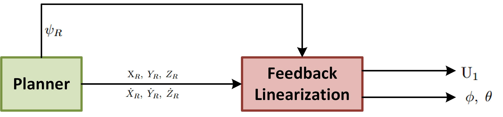

# 03. Feedback Linearization (Position Controller)

## 1. Overview

The position controller functions as the outer loop of the synchronous cascaded architecture. Its primary objective is to track the reference spatial coordinates generated by the Trajectory Generator. Because the translational dynamics of the quadrotor are highly nonlinear and strongly coupled with the vehicle's attitude, Feedback Linearization (FL) is utilized to algebraically cancel the nonlinearities.

This controller directly computes the total thrust $U_1$ (sent directly to the quadrotor plant) and the reference roll and pitch angles $\phi_{ref}, \theta_{ref}$ (sent to the inner-loop NMPC).

<p align="center">
  
</p>

<p align="center">
  <i>Figure 1: Signal flow diagram illustrating the input-output interface of the Feedback Linearization controller.</i>
</p>

---

## 2. Position Tracking Error Dynamics

The position tracking error vector $\mathbf{e}_p$ quantifies the deviation between the quadrotor's actual position in the inertial frame and the desired reference trajectory:

```math
\mathbf{e}_p
=
\begin{bmatrix}
e_x \\
e_y \\
e_z
\end{bmatrix}
=
\begin{bmatrix}
X-X_{ref} \\
Y-Y_{ref} \\
Z-Z_{ref}
\end{bmatrix}
```

where $e_x$, $e_y$, and $e_z$ denote the position tracking errors along the inertial $X$, $Y$, and $Z$ axes, respectively.

Taking the second time derivative of the error vector yields the acceleration error dynamics:

```math
\ddot{e}_x
=
\ddot{X}
-
\ddot{X}_{ref}
```

```math
\ddot{e}_y
=
\ddot{Y}
-
\ddot{Y}_{ref}
```

```math
\ddot{e}_z
=
\ddot{Z}
-
\ddot{Z}_{ref}
```

Therefore, the complete acceleration error vector can be written as

```math
\ddot{\mathbf{e}}_p
=
\begin{bmatrix}
\ddot{e}_x \\
\ddot{e}_y \\
\ddot{e}_z
\end{bmatrix}
```

---

## 3. Feedback Linearization & Virtual Control

To force the nonlinear translational dynamics to behave as a stable linear system, a virtual control input vector $\mathbf{v}$ is introduced:

```math
\mathbf{v}
=
\begin{bmatrix}
v_x \\
v_y \\
v_z
\end{bmatrix}
```

For each position axis, the desired virtual acceleration is defined using a proportional-derivative control law:

```math
v_i
=
\ddot{x}_{ref,i}
-
K_{1,i}\dot{e}_i
-
K_{2,i}e_i
\qquad
i \in \{x,y,z\}
```

Equivalently, the three virtual acceleration commands are

```math
v_x
=
\ddot{X}_{ref}
-
K_{1,x}\dot{e}_x
-
K_{2,x}e_x
```

```math
v_y
=
\ddot{Y}_{ref}
-
K_{1,y}\dot{e}_y
-
K_{2,y}e_y
```

```math
v_z
=
\ddot{Z}_{ref}
-
K_{1,z}\dot{e}_z
-
K_{2,z}e_z
```

Substituting these virtual controls into the error dynamics results in a decoupled, homogeneous second-order differential equation for each axis:

```math
\ddot{e}_i
+
K_{1,i}\dot{e}_i
+
K_{2,i}e_i
=
0
```

for

```math
i \in \{x,y,z\}
```

By selecting strictly positive gains $K_{1,i}$ and $K_{2,i}$, the characteristic polynomial

```math
s^2
+
K_{1,i}s
+
K_{2,i}
```

is strictly stable.

This guarantees that the position tracking error converges asymptotically to zero for the nominal model.

---

## 4. Inverse Dynamics (Mapping to Physical Inputs)

The virtual accelerations

```math
\mathbf{v}
=
\begin{bmatrix}
v_x \\
v_y \\
v_z
\end{bmatrix}
```

calculated in the inertial frame must be mapped back to the physical quadrotor inputs.

From the vertical translational dynamics, the total thrust required to execute the vertical virtual acceleration $v_z$ is extracted algebraically:

```math
U_1
=
\frac{
m(g+v_z)
}{
\cos\phi\cos\theta
}
```

The required horizontal virtual accelerations determine the necessary roll and pitch reference angles.

Using the Z-Y-X Euler-angle convention, the horizontal acceleration equations are

```math
v_x
=
\frac{U_1}{m}
\left(
\cos\phi\sin\theta\cos\psi
+
\sin\phi\sin\psi
\right)
```

```math
v_y
=
\frac{U_1}{m}
\left(
\cos\phi\sin\theta\sin\psi
-
\sin\phi\cos\psi
\right)
```

The corresponding horizontal virtual acceleration vector is therefore

```math
\mathbf{v}_{xy}
=
\begin{bmatrix}
v_x \\
v_y
\end{bmatrix}
```

while the desired thrust direction is determined by

```math
\mathbf{v}
=
\begin{bmatrix}
v_x \\
v_y \\
v_z
\end{bmatrix}
```

The inverse-dynamics mapping can therefore be summarized as

```math
\begin{bmatrix}
v_x \\
v_y \\
v_z
\end{bmatrix}
\longrightarrow
\begin{bmatrix}
U_1 \\
\phi_{ref} \\
\theta_{ref}
\end{bmatrix}
```

Thus, the outer-loop Feedback Linearization controller converts the desired translational acceleration into the thrust magnitude and attitude references required by the inner-loop controller.

---

## 5. Output to the Inner-Loop Architecture

The reference yaw angle $\psi_{ref}$ is provided directly by the Trajectory Generator and is treated as an exogenous input to the position controller.

This separates the heading control from the planar position control while allowing the desired yaw angle to influence the mapping between horizontal acceleration and the required roll and pitch references.

The position controller produces the total thrust and the reference roll and pitch angles:

```math
\mathbf{y}_{pos}
=
\begin{bmatrix}
U_1 \\
\phi_{ref} \\
\theta_{ref}
\end{bmatrix}
```

These outputs are then passed to the corresponding components of the cascaded control architecture.

The complete attitude reference vector sent down to the inner-loop NMPC is

```math
\mathbf{x}_{a,ref}
=
\begin{bmatrix}
\phi_{ref} \\
\theta_{ref} \\
\psi_{ref}
\end{bmatrix}
```

The resulting hierarchical signal flow is therefore

```math
\begin{bmatrix}
X_{ref} \\
Y_{ref} \\
Z_{ref}
\end{bmatrix}
\longrightarrow
\text{Feedback Linearization}
\longrightarrow
\begin{bmatrix}
U_1 \\
\phi_{ref} \\
\theta_{ref}
\end{bmatrix}
```

with the desired yaw reference supplied separately:

```math
\psi_{ref}
\longrightarrow
\mathbf{x}_{a,ref}
=
\begin{bmatrix}
\phi_{ref} \\
\theta_{ref} \\
\psi_{ref}
\end{bmatrix}
```

The outer-loop controller therefore provides the translational control action and the required attitude references to the inner-loop NMPC, which subsequently regulates the quadrotor's rotational dynamics.
