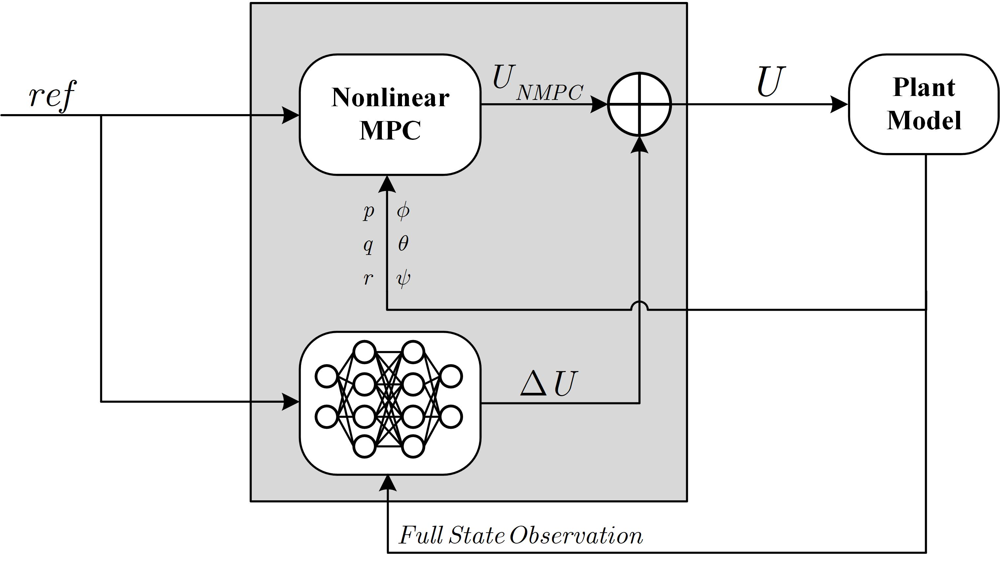

# 04. Safe RL-NMPC Integration (Inner Loop)

## 1. Residual Control Topology

  

<i>Figure 1: The Inner Loop Parallel Topology, showcasing the constraint-aware NMPC baseline and the RL residual compensator.</i>

The inner loop of the cascaded architecture handles the quadrotor's fast rotational dynamics. Because the attitude dynamics are highly nonlinear and subject to strict actuator constraints, a standard linear controller is insufficient. To achieve high-precision tracking while mitigating unmodeled aerodynamic disturbances, this architecture implements a **Parallel Residual Control Topology**.

The inner loop consists of two distinct but concurrent modules:
*   **Nonlinear Model Predictive Control (NMPC):** Acts as the primary constraint-aware baseline controller, generating the nominal control torques $\mathbf{U}_{NMPC}$.
*   **Reinforcement Learning (RL) Agent:** Acts as a data-driven compensator, computing high-frequency residual torques $\Delta\mathbf{U}_{RL}$ to correct for nonlinearities not captured by the nominal physical model.

## 2. Nonlinear MPC Formulation (Baseline)

Unlike Linear Parameter-Varying (LPV) approaches that rely on successive linearization matrices ($A(\sigma), B(\sigma)$), the NMPC acts directly on the nonlinear kinematics and dynamics. It serves as the mathematical backbone of the inner loop, guaranteeing feasibility and baseline stability.

The continuous-time rotational dynamics are represented as a nonlinear function $\dot{\mathbf{x}}_a = f(\mathbf{x}_a, \mathbf{U}_{NMPC})$. For digital implementation, this model is discretized (e.g., via 4th-order Runge-Kutta) into:

$$ \mathbf{x}_{a, k+1} = f_d(\mathbf{x}_{a, k}, \mathbf{U}_{k, NMPC}) $$

At each sampling step, the NMPC solves a finite-horizon Nonlinear Programming (NLP) problem over a prediction horizon $N_p$. To ensure smooth control actions and prevent high-frequency actuator chattering, the cost function $J$ penalizes the state tracking errors as well as the control increments ($\Delta\mathbf{U}_k = \mathbf{U}_k - \mathbf{U}_{k-1}$):

$$ J = \frac{1}{2} \|\mathbf{x}_{a, N_p} - \mathbf{x}_{a, ref}\|_{Q_f}^2 + \frac{1}{2} \sum_{k=0}^{N_p-1} \left( \|\mathbf{x}_{a, k} - \mathbf{x}_{a, ref}\|_Q^2 + \|\Delta\mathbf{U}_{k, NMPC}\|_R^2 \right) $$

Subject to the nonlinear system dynamics and the strict physical actuator constraints (mapped from rotor limits $\Omega_{min}$ to $\Omega_{max}$):

$$ \mathbf{x}_{a, k+1} = f_d(\mathbf{x}_{a, k}, \mathbf{U}_{k, NMPC}) $$
$$ \mathbf{U}_{min} \le \mathbf{U}_{k, NMPC} \le \mathbf{U}_{max} $$

By solving this constrained NLP problem, the NMPC guarantees that the baseline control torque $\mathbf{U}_{NMPC}$ is mathematically optimal and strictly respects the physical boundaries of the quadrotor.

## 3. The Sim-to-Real Gap and RL Adaptability

While the NMPC provides a principled framework for constraint handling and stability guarantees, its performance inherently deteriorates under model mismatches. The nonlinear solver relies on the nominal mathematical model $f_d(x, u)$, which neglects complex, unmodeled aerodynamics such as blade flapping, high-speed cornering drag, and ground effects.

Reinforcement Learning (RL) optimizes control policies directly from interaction data, adapting effectively to unmodeled dynamics without requiring an exact analytical model. However, pure model-free RL lacks formal guarantees of safety and recursive feasibility. To bridge these paradigms, the RL agent is integrated strictly as a residual compensator.

## 4. Safe Action Fusion 

To extract the adaptability of RL without compromising the mathematical rigor of the NMPC, the outputs from both modules are additively fused. To ensure absolute safety, the residual action from the RL agent is strictly bounded before execution:

$$ \mathbf{U}_{final} = \mathbf{U}_{NMPC} + \text{clip}(\Delta\mathbf{U}_{RL}, -\epsilon, \epsilon) $$

By restricting the RL output to a narrow operational band $[-\epsilon, \epsilon]$, the system enforces practical input-to-state stability (ISS). The quadrotor remains within the safe Region of Attraction defined by the NMPC constraints, while the RL agent neutralizes the residual nonlinear errors. To train an agent capable of outputting this precise compensation, we formulate a fully observable Markov Decision Process (MDP) and employ the Twin Delayed DDPG (TD3) algorithm, detailed in Section 05.
