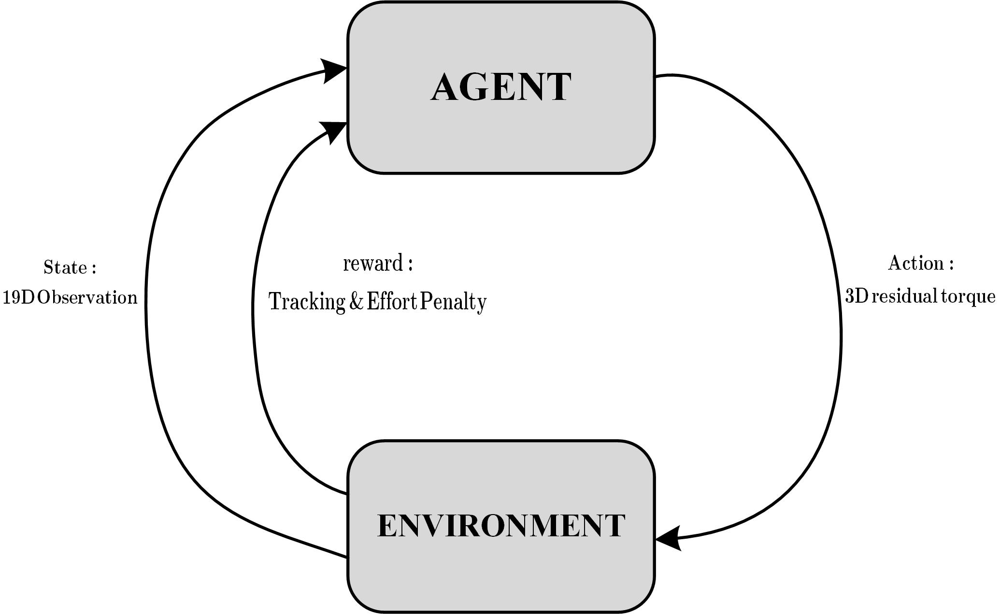

# 05. Twin Delayed DDPG (TD3) Agent Design

## 1. Rationale for TD3 in Residual Control

Reinforcement Learning for quadrotor attitude compensation requires continuous action spaces to generate precise motor torques. While standard algorithms like Deep Deterministic Policy Gradient (DDPG) handle continuous domains, they are highly susceptible to Q-value overestimation, leading to sub-optimal and oscillating policies. The Twin Delayed DDPG (TD3) algorithm mitigates this overestimation bias, providing the monotonic convergence and deterministic stability required to act as a safe, high-frequency residual compensator ($\Delta\mathbf{U}_{RL}$) operating concurrently with the NMPC baseline.

## 2. Markov Decision Process (MDP) Framework

The learning environment is formulated as a fully observable MDP defined by the tuple $M = \{S, A, P, R, \gamma\}$. 

  

  <i>Figure 1: The Markov Decision Process state transition graph and the Agent-Environment interaction loop.</i>

At each time step, the agent observes the state $S_t$, executes an action $A_t$, and the environment returns a reward $R_t$ alongside the next state $S_{t+1}$. For the quadrotor residual control task, this MDP is structured as follows:

**Observation Space ($S \in \mathbb{R}^{19}$)**
To ensure zero-shot generalization to unseen trajectories, the agent processes a 19-dimensional normalized vector instead of absolute global coordinates:
*   **Current State Errors (10-D):** Position tracking errors ($e_x, e_y, e_z$), heading error ($e_\psi$), body linear velocities ($u, v, w$), and angular rates ($p, q, r$).
*   **Predictive Lookahead (9-D):** Future spatial errors between the quadrotor's current position and the reference trajectory at indices $k+3, k+6,$ and $k+10$. This allows the agent to anticipate sharp maneuvers.

**Action Space ($A \in \mathbb{R}^3$)**
The Actor network outputs a continuous 3-dimensional vector corresponding to the roll, pitch, and yaw residual torques. The raw action is bounded via a $\tanh$ activation to $[-1, 1]$ and physically scaled by $0.01$ to strictly limit the intervention to $\Delta\mathbf{U}_{RL} \in [-0.01, 0.01]$ Nm.

**Reward Function ($R$)**
The dense quadratic reward minimizes tracking errors and control effort:

$$r_t = -(10\|\mathbf{e}_{pos}\|^2 + 5|e_\psi|^2 + 2\|\mathbf{e}_{att}\|^2 + 0.1\|\mathbf{U}_{final}\|^2)$$

An episode is terminated immediately with a static penalty of $-1000$ if the spatial error exceeds $2.0m$.

## 3. Actor-Critic Foundation

  

<i>Figure 2: Fundamental Actor-Critic architecture illustrating the Temporal-Difference (TD) error evaluation and backpropagation loop.</i>

The TD3 algorithm builds upon the Actor-Critic architecture. The Actor network maps the state directly to a deterministic action policy $\pi_\theta(s_t)$, while the Critic network estimates the action-value function $Q(s_t, a_t)$ to evaluate the chosen action. The Temporal-Difference (TD) error is computed based on the reward and the Critic's estimate of the subsequent state, which is then backpropagated to update both network weights.

## 4. TD3 Network Architecture and Training Dynamics

To resolve the instability of standard Actor-Critic setups, the TD3 architecture introduces twin critics, delayed updates, and target networks.

  

<i>Figure 3: Detailed TD3 Architecture featuring Twin Target Critics, Target Actor, and the Experience Pool.</i>

As illustrated in the TD3 structure above:
*   **Experience Pool:** Interaction data $(s, a, r, s')$ is stored and randomly sampled in mini-batches (size 256) to break temporal correlations during training.
*   **Clipped Double Q-Learning:** The architecture utilizes two parallel Target Critic networks generating $Q_{\omega 1}(s', a')$ and $Q_{\omega 2}(s', a')$. The algorithm takes the minimum of these two values, $\min(Q_1, Q_2)$, to calculate the Critic Loss, strictly preventing the overestimation of expected returns.
*   **Delayed Soft Updates:** The Actor Network is updated less frequently than the Critics (e.g., 1 update every 2 iterations). Target networks are updated via a Soft Update mechanism ($\tau = 0.005$) to ensure the learning targets change smoothly over time.
*   **Target Policy Smoothing:** Clipped Gaussian Action Noise ($\sigma = 0.22$) is added to the target actions ($a'$) during the Critic update, smoothing the Q-value landscape and preventing the agent from exploiting sharp peaks.
