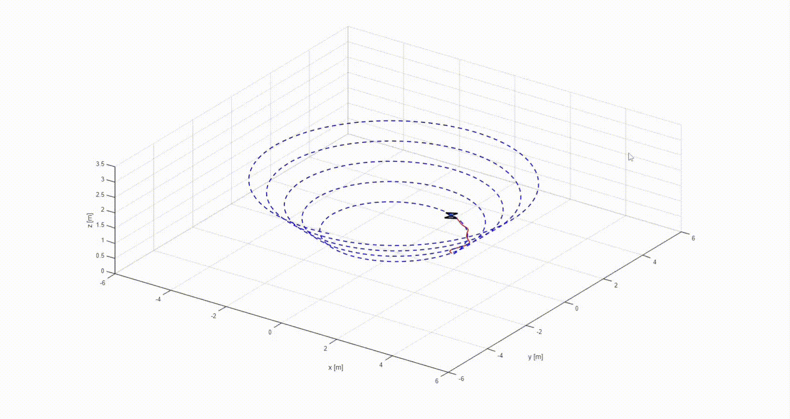
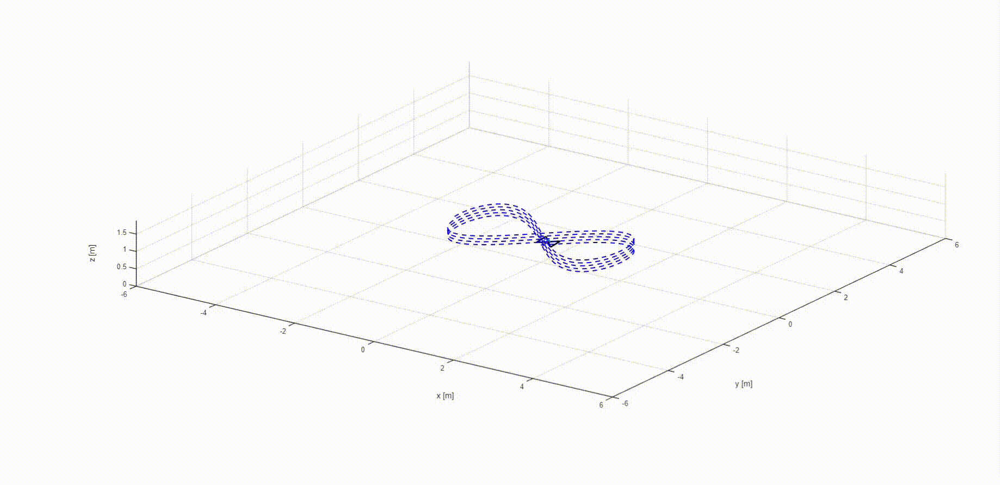
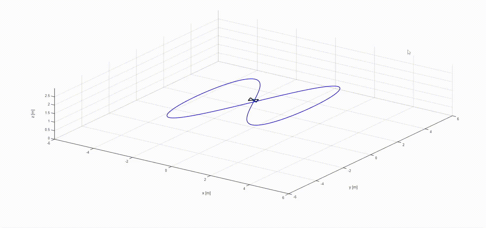
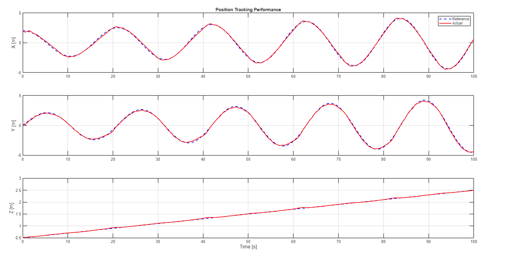
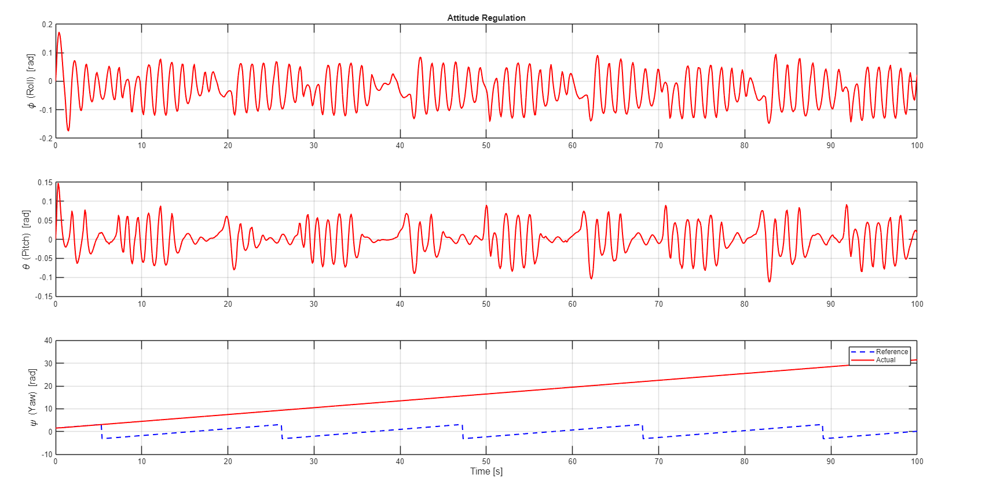
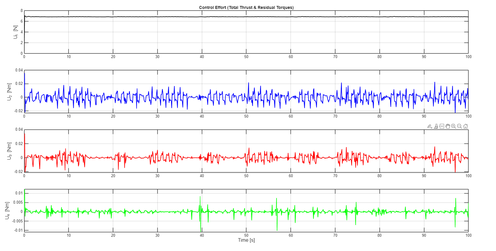

# 06. Zero-Shot Generalization and Simulation Results

To validate the effectiveness, robustness, and safety of the proposed Residual RL-NMPC architecture, comprehensive simulations are conducted using a custom MATLAB/Simulink environment. The primary objective is to evaluate the system's "Zero-Shot" generalization capability—its ability to safely track highly complex, aggressive trajectories that the Reinforcement Learning agent has never encountered during its training phase.

## 1. Simulation Setup & 3D Spatial Tracking

During the training phase, the TD3 agent was exposed exclusively to a simplified 3D Spiral trajectory to learn fundamental aerodynamic compensations. For the evaluation phase, the trained policy is locked (inference mode), and the quadrotor is tasked with navigating unseen, aggressive nonlinear curves (Figure-8 and Lissajous trajectories) subject to unmodeled aerodynamic drag.

  

<i>Figure 1: Animated simulation of the quadrotor tracking an unseen 3D trajectory in real-time.</i>

### 1.1. Figure-Eight and Complex Lissajous Trajectories
To push the dynamic limits, the system navigates paths requiring simultaneous, high-frequency state variations across all three spatial axes.

  

<i>Figure 2: 3D spatial tracking of the Figure-8 trajectory. The reference path is represented by the blue dashed line, and the actual RL-NMPC flight path is the solid red line.</i>

  

<i>Figure 3: 3D spatial tracking of the highly complex Lissajous (Butterfly) curve.</i>

**Tracking Analysis:** As observed in Figures 2 and 3, the actual flight path (red) flawlessly traces the complex reference curves (blue). Traditional predictive controllers typically suffer from spatial drift at these sharp corners due to unmodeled nonlinearities. The RL-NMPC architecture successfully neutralizes this sim-to-real gap, utilizing the residual control signal ($\Delta\mathbf{U}_{RL}$) to prevent divergent oscillations and corner-cutting.

## 2. Quantitative State Error Analysis

To dissect the tracking performance, the time-series transient responses of both translational and rotational dynamics are mathematically analyzed.

  

<i>Figure 4: Time-series evaluation of Position Tracking ($X, Y, Z$) amplitudes.</i>

**Translational Dynamics (Position):** Figure 4 demonstrates a near-perfect amplitude match across the $X, Y,$ and $Z$ axes with zero phase lag. This confirms that the 9-dimensional predictive lookahead within the TD3 observation space successfully enables the agent to anticipate sharp spatial transitions before the quadrotor physically reaches them.

  

<i>Figure 5: Real-time attitude regulation (Roll, Pitch, Yaw) dynamically commanded by the outer loop.</i>

**Rotational Dynamics (Attitude):** The attitude responses in Figure 5 exhibit specific behaviors inherent to underactuated physics and topological mathematics:
* **Roll ($\phi$) and Pitch ($\theta$) Oscillations:** A quadrotor lacks independent lateral thrusters. To carve continuous 3D curves, it must continuously bank to direct its thrust vector horizontally. Therefore, the high-frequency oscillations observed are not control instabilities, but precise, physically necessary micro-maneuvers. Furthermore, these angles lack predefined global references (blue lines) because they are dynamically generated in real-time by the outer-loop Feedback Linearization.
* **Yaw ($\psi$) Angle Wrapping:** The apparent divergence between the Yaw reference (blue) and actual Yaw (red) is a mathematical artifact of angle wrapping, not a tracking failure. While the reference trajectory strictly resets within $[-\pi, \pi]$, the integrated controller intentionally accumulates the actual yaw angle continuously. This intelligent behavior prevents the physical vehicle from executing dangerous, instantaneous **360°** mechanical snaps, ensuring smooth and physically viable heading alignment.

## 3. Control Effort and Actuator Safety Verification

A critical barrier to deploying model-free Reinforcement Learning in physical systems is the generation of unbounded control commands that can saturate or damage Brushless DC (BLDC) motors.

  

<i>Figure 6: Generated Control Inputs. $U_1$ represents the total lifting thrust, while $U_2, U_3, U_4$ represent the rotational torques.</i>

**Control Analysis:** Figure 6 mathematically verifies the safety guarantees of the cascaded architecture:
* The total thrust ($U_1$) remains exceptionally stable around **7 N** to counteract gravity, proving that the outer loop smoothly handles translational momentum without jitter.
* The rotational torques ($U_2, U_3, U_4$) exhibit high-frequency variations, which represent the exact residual corrections ($\Delta\mathbf{U}_{RL}$) compensating for aerodynamic drag. Crucially, these high-frequency signals are strictly clamped within a narrow safety envelope (predominantly between **-0.05** and **0.05 Nm**). 

**Conclusion:** The simulation results prove that the RL agent strictly operates as a "residual compensator." It successfully fine-tunes the baseline mathematical model to achieve zero-shot generalization and perfect tracking, without ever generating extreme values that would jeopardize flight safety or saturate the physical actuators.
